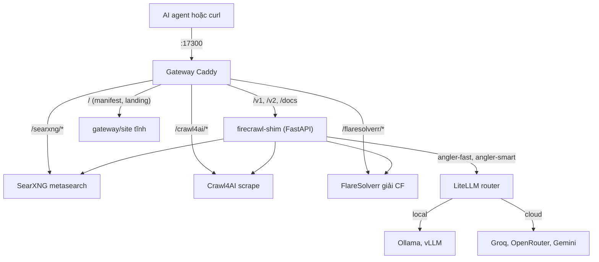
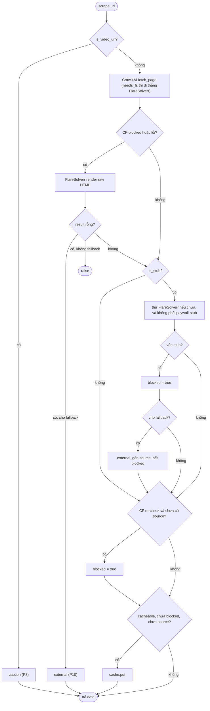
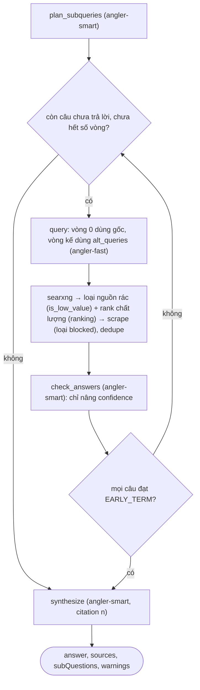
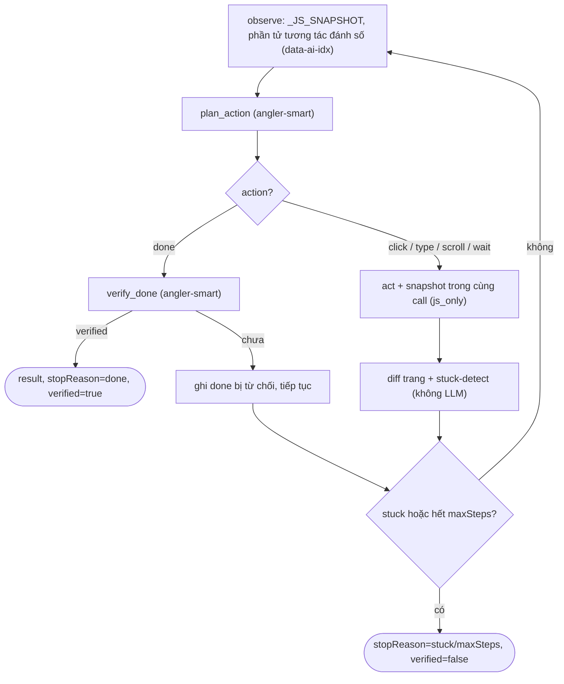
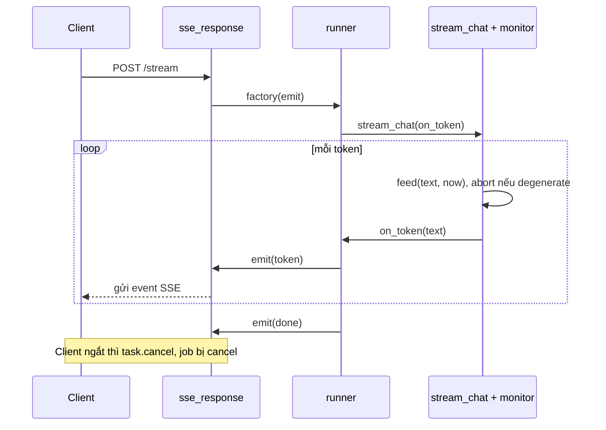
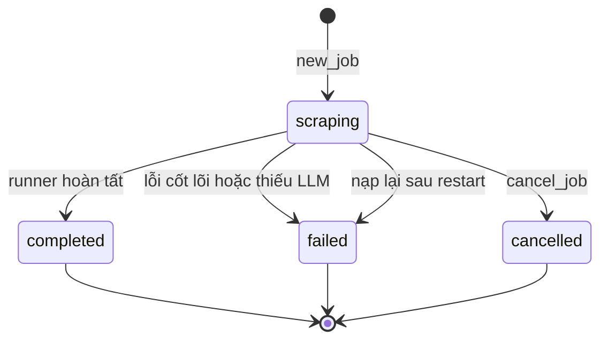

# Angler — Đặc tả kỹ thuật

Đây là tài liệu kỹ thuật chính thức của Angler, một stack search + crawl cho AI agent chạy local.
Nó mô tả kiến trúc, các nguyên tắc cốt lõi, và thiết kế của từng tính năng.

Mục tiêu của tài liệu: giúp hiểu được *vì sao* hệ thống làm như vậy trước khi sửa.

> Tài liệu liên quan:
> [README.md](../README.md) cho tham chiếu API và ví dụ curl;
> [GIOI-THIEU-SAN-PHAM.md](./GIOI-THIEU-SAN-PHAM.md) cho phần giới thiệu sản phẩm, use-case, ROI;
> [ROADMAP.md](./ROADMAP.md) cho định hướng.

---

## 1. Tổng quan

Angler là một stack search + crawl chạy local, phục vụ một người dùng là chủ máy. Năm service đứng
sau một gateway Caddy và chỉ lộ ra một port duy nhất là `17300`.

Vì chạy trong mạng tin cậy nên stack cố tình không có auth và không rate-limit. Đừng thêm hai thứ
này, trừ khi bạn đưa nó ra ngoài mạng. Sứ mệnh của Angler là làm công cụ nghiên cứu: ưu tiên đa dạng
nguồn, chống thiên lệch, và không phụ thuộc cloud.

Code first-party duy nhất là `firecrawl-shim/`, một app FastAPI nói "tiếng Firecrawl" để agent quen
Firecrawl cắm vào mà không phải sửa code. Các service còn lại (`searxng`, `crawl4ai`, `flaresolverr`,
`litellm`, `gateway`) là image upstream, chỉ cấu hình qua compose. Tài liệu và comment trong code
viết bằng tiếng Việt.

---

## 2. Kiến trúc gateway

Caddy reverse-proxy theo tiền tố path. Có hai kiểu routing, và sự khác biệt là có chủ đích.

Kiểu thứ nhất là `handle_path` cho `/searxng/*`, `/crawl4ai/*`, `/flaresolverr/*`, `/firecrawl/*`.
Nó cắt tiền tố đi để backend thấy đúng path gốc của nó.

Kiểu thứ hai là `handle` cho `/v1/*` và `/v2/*`, và nó không cắt tiền tố. Lý do: Firecrawl SDK dựng
path tuyệt đối như `/v1/scrape` và bỏ mất base path, nên shim phải mount ở gốc gateway cho `/v1` và
`/v2`. Agent chỉ cần đặt `FIRECRAWL_API_URL=http://localhost:17300` là chạy. Path `/firecrawl/*` chỉ
để gọi tay khi debug.

Phần docs nằm ở gốc: `/openapi.json`, `/docs`, `/redoc` đều reverse-proxy về shim (FastAPI tự phục
vụ).

Lớp discovery để stack tự mô tả là các file tĩnh trong `gateway/site/` (bind-mount read-only, Caddy
`file_server`):

- `index.html`: landing page cho người đọc.
- `llms.txt`: mô tả ngắn cho LLM agent.
- `manifest.json`: mục lục máy-đọc, trỏ tới openapi/spec của từng service.

Gốc `/` làm content-negotiation: `Accept: application/json` thì trả `manifest.json`, còn lại thì trả
HTML landing. SearXNG và FlareSolverr không có OpenAPI, và manifest ghi rõ điều đó.

Mọi backend chỉ `expose` ra mạng nội bộ. Chỉ gateway publish port ra host.

---

## 3. Bản đồ module trong firecrawl-shim (`firecrawl-shim/app/`)

| Module | Vai trò |
|---|---|
| `main.py` | FastAPI app và toàn bộ route. Mỗi route đăng ký cho cả `/v1` lẫn `/v2` (cùng schema; chỉ `/search` khác shape). |
| `clients.py` | Wrapper httpx async cho Crawl4AI/FlareSolverr/SearXNG và LLM. Gồm `llm_chat`, `llm_json`, `llm_available`, `stream_chat`. Dùng chung một `AsyncClient`. |
| `scrape.py` | Scrape một URL (chuỗi fallback CF/stub/external) và `site_map`. |
| `transform.py` | Đổi result của Crawl4AI sang schema Firecrawl; phát hiện Cloudflare và stub; lưới an toàn cho `onlyMainContent`. |
| `crawl_jobs.py` | Job async cho `/crawl` (BFS deep-crawl) và `/batch/scrape`. `JOBS` là cache RAM. Có `new_job`, `spawn`, `persist_bg`. |
| `research.py` | Bộ gom nguồn chống thiên lệch của `/research`. |
| `research_llm.py` | Dịch query đa ngôn ngữ và so-chéo nguồn (cần LLM, fail-open). |
| `search.py` | `/search` qua SearXNG, có tùy chọn scrape từng kết quả. |
| `ranking.py` | Xếp hạng dùng chung cho `/search` và `/research`: chấm điểm point-wise đa tín hiệu rồi đa dạng hóa MMR. Hàm thuần. Xem [THIET-KE-RANKING.md](./THIET-KE-RANKING.md). |
| `query_intent.py` | Phân tích ngôn ngữ và địa lý của các bên trong query (LLM `angler-fast`, fail-open về heuristic, có cache). |
| `extract.py` | `/extract`: scrape rồi cho LLM trích xuất (cần LLM). |
| `deepresearch.py` | Vòng lặp nghiên cứu sâu (async job, LLM). |
| `excerpt.py` | Trích đoạn liên quan nhất từ markdown dài (keyword + mật độ số liệu, bỏ nav) cho deep-research, thay vì cắt N ký tự đầu. Hàm thuần. |
| `agent.py` | Browser agent tự lái (async job, LLM). |
| `fallback.py` | Scrape từ dịch vụ ngoài (Jina/Firecrawl cloud), opt-in. |
| `llm_stream.py` | Streaming LLM cộng guard chống degenerate. |
| `sse.py` | `sse_response(factory)`: bọc một coroutine thành SSE. |
| `monitor.py` | Theo dõi thay đổi trang (sweeper nền). |
| `transcript.py` | Video sang transcript (chỉ caption). |
| `egress.py` | Chọn egress direct/vpn/proxy theo từng request. |
| `eval/` | Eval harness: đo extraction accuracy và synthesis faithfulness. |
| `store.py` | Lưu job và monitor xuống SQLite. |
| `models.py` | Pydantic request models (đều `extra="ignore"` để bỏ qua field lạ của SDK). |
| `config.py` | Cấu hình qua env, mặc định dùng DNS nội bộ Docker. |
| `domains.py`, `cache.py` | Nhớ "domain cần FlareSolverr" (có TTL) và cache scrape (RAM, key gồm proxy). |
| `applog.py` | Activity log: `event(kind, msg, level, **fields)` ghi ra stdout và ghi một dòng có cấu trúc xuống bảng `events` SQLite khi level >= `LOG_DB_LEVEL`. Ghi nền theo lô. `request_id` (middleware HTTP) nối các event của cùng một request; job nền dùng job_id. Event cũ tự dọn theo TTL. |

---

## 4. Nguyên tắc cốt lõi (đọc trước khi sửa)

Đây là các quy tắc lặp lại ở nhiều tính năng. Phá một cái là phá triết lý hệ thống.

### 4.1. Anti-bias qua `metadata.blocked`

Nguồn bị chặn (HTTP 200 nhưng rỗng do anti-bot, paywall, hoặc JS-shell; hoặc trang Cloudflare-challenge
chưa giải) phải bị gắn `blocked=true`. Tuyệt đối không âm thầm tính nó là "có nội dung". Một nguồn bị
chặn mà coi như có nội dung chính là một dạng thiên lệch do công cụ tạo ra. Vì vậy `/research`,
`/deep-research`, `/monitor` đều loại nguồn `blocked` ra khỏi tính toán.

### 4.2. `onlyMainContent` chỉ lọc, và có lưới an toàn

Nó chỉ gắn `PruningContentFilter`, vốn chỉ ảnh hưởng `fit_markdown`. Đừng thêm `excluded_tags` hay
`word_count_threshold`, vì hai thứ này cắt luôn `raw_markdown` và làm hỏng lưới an toàn. Lưới hoạt
động thế này: nếu `fit_markdown` nhỏ hơn 30% của một `raw_markdown` đáng kể (trên 2000 ký tự) thì trả
về full text, để trang dài như văn bản luật không bị cắt quá tay.

### 4.3. Chuỗi fallback scrape có thứ tự cố định

Thứ tự là Crawl4AI, rồi FlareSolverr, rồi kiểm tra stub, rồi external (opt-in). Mỗi nấc có lý do
riêng, và cờ `blocked` được gắn khi mọi cách đều bó tay. Chi tiết ở mục 5.

### 4.4. Job store là RAM cộng SQLite

`JOBS` là cache sống. Mỗi lần đổi trạng thái thì ghi cả job dạng JSON xuống SQLite, để job sống qua
restart. Khi khởi động lại, các job chưa hết hạn được nạp lại; job nào còn dở dang ở `scraping` bị
đánh `failed` với lý do "interrupted by restart". Job là `asyncio.create_task`, không phải worker
queue. Hủy job là best-effort: vòng lặp tự kiểm `status == "cancelled"`.

### 4.5. Mọi route đăng ký cả `/v1` và `/v2`

Hai prefix dùng chung schema. Ngoại lệ duy nhất là search: `/v1/search` trả `data` dạng list phẳng,
còn `/v2/search` trả `data` dạng `{"web": [...]}` để khớp model SDK Firecrawl v4.

### 4.6. Quy ước fail-open và fail-closed

Bước phụ (retrieval, làm sạch, dịch, so-chéo) thì fail-open: lỗi thì fallback mềm rồi ghi `warnings`,
không làm sập job. Bước cốt lõi (synthesis, extract, verify của agent) thì fail-closed: thiếu LLM hay
lỗi thì job `failed` hoặc `verified=false`, không giả vờ thành công. Nói rõ giới hạn quan trọng hơn
là trông có vẻ hoàn hảo.

### 4.7. Mọi call LLM đi qua LiteLLM bằng đúng hai tên ảo

Code chỉ gọi `clients.llm_chat`, `llm_json`, hoặc `stream_chat` với model `angler-fast` hoặc
`angler-smart` (mặc định `LLM_MODEL` là `angler-smart`). LiteLLM dịch tên ảo sang model thật
(local hoặc cloud) và lo fallback. App không bao giờ biết hay phụ thuộc một model/provider cụ thể, và
response trả về vẫn mang đúng tên ảo. Không có tên model thật nào hard-code trong shim, cũng không có
call trực tiếp tới Ollama hay provider.

### 4.8. Không phá chữ ký hàm cũ

Tham số mới luôn mặc định `None` hoặc giá trị cũ (như `proxy=None`, `fallback=None`, `on_token=None`,
`emit=None`); request model thì `extra="ignore"`. Tính năng mới bật tắt bằng config, không viết lại
đường cũ.

---

## 5. Scrape core, nền của mọi thứ

Hàm gốc là `scrape.scrape(url, formats, only_main_content, ...)`, trả về `(data, raw_result, used_fs)`.
Các endpoint `/search`, `/research`, `/crawl`, `/batch`, `/deep-research`, `/monitor`, `/agent` đều
dùng lại hàm này.

Quy tắc cache: chỉ cache khi không `blocked` và `data.metadata` không có `source`, tức là kết quả
local thuần. Kết quả `blocked` và kết quả từ external thì không cache, để lần sau còn thử lại và để
không phục vụ nội dung ngoài cho một request local. Cache key có gồm `proxy`. Chỉ ghi nhớ "domain cần
FlareSolverr" (`domains.mark_fs`) khi FlareSolverr thật sự ra được nội dung, tức hết `blocked`.

Các hàm trong [transform.py](../firecrawl-shim/app/transform.py):

- `is_cloudflare_blocked(result)`: đúng khi result là `None`, hoặc status 403/429/503, hoặc title là
  "just a moment" / "attention required", hoặc có marker CF trong HTML.
- `is_stub(markdown, title, url)`: phân biệt vỏ rỗng anti-bot với một trang ngắn hợp lệ. Coi là stub
  khi title bằng tên miền trần, hoặc có cụm chống-bot/paywall, hoặc markdown dưới 40 ký tự trên URL
  không-gốc (ví dụ trang chỉ có tagline), hoặc dưới 120 ký tự trên URL path sâu.
- `is_paywall_stub`: loại stub mà FlareSolverr không giải nổi (paywall, login, geo-block). Gặp loại
  này thì gắn `blocked` luôn, khỏi tốn một cú giải CF vô ích.
- `markdown_of(result, only_main)`: chọn giữa `fit_markdown` và `raw_markdown`, kèm lưới an toàn 30%
  ở nguyên tắc 4.2.

`site_map(url, limit, includeSubdomains, search)` gom link từ trang và từ sitemap đệ quy, giới hạn
bởi `SITEMAP_MAX_FILES`.

---

## 6. Thiết kế từng tính năng

### LiteLLM router

#### Mục đích

Cho một cổng LLM duy nhất theo chuẩn OpenAI, cắm được cả local (Ollama/vLLM) lẫn cloud, có fallback
tự động. Đây là cách hiện thực ý "local hay cloud là tùy người dùng chọn".

#### Thiết kế

Service `litellm` (image `ghcr.io/berriai/litellm`) `expose` cổng 4000 nội bộ và mount
`litellm/config.yaml`. Config định nghĩa hai model-group: `angler-fast` cho việc cơ học và
`angler-smart` cho suy luận khó. Mỗi group có thể liệt kê nhiều deployment kèm `fallbacks`, để router
rớt xuống deployment kế khi gặp lỗi, 429, hoặc timeout, và cooldown deployment vừa lỗi. Shim chỉ trỏ
`LLM_BASE_URL=http://litellm:4000/v1` cùng tên group; toàn bộ logic local đối cloud nằm trong config.

#### Quyết định then chốt

- LiteLLM phải start được dù key rỗng hoặc chưa có model. Deployment chỉ fail lúc *gọi*, không fail
  lúc *khởi động*, tức nó nằm im cho tới khi cấu hình provider. Nhờ vậy `docker compose up` phần lõi
  không vỡ.
- `router_settings` có `num_retries`, `allowed_fails`, `cooldown_time`, và `timeout`. `timeout` cắt
  deployment bị treo để kích hoạt fallback, vì free model hay hang. `drop_params: true` bỏ param mà
  provider không hỗ trợ (như `response_format`) thay vì làm vỡ request.
- Fail-closed một cách minh bạch: nếu chưa cấu hình hoặc mọi backend chết, litellm trả lỗi, `llm_chat`
  raise, và job `failed` với đúng thông báo đó. Không im lặng degrade.

#### Cấu hình

`LLM_BASE_URL`, `LLM_MODEL` (mặc định `angler-smart`), `LLM_MODEL_FAST`, `LLM_MODEL_SMART`,
`LLM_API_KEY` (rỗng, internal), và `LLM_JSON_NATIVE` (mặc định 1; đặt 0 cho model thinking vì
`response_format=json_object` làm content rỗng).

### `/search` và lớp xếp hạng ([search.py](../firecrawl-shim/app/search.py), [ranking.py](../firecrawl-shim/app/ranking.py), [query_intent.py](../firecrawl-shim/app/query_intent.py))

#### Mục đích

`/search` không chỉ trả "kết quả liên quan nhất" mà kết quả toàn diện nhất: ưu tiên nguồn tin cậy và
nguồn mới, phủ đủ góc nhìn (loại nguồn, ngôn ngữ, địa lý). Đây là USP của Angler. Cùng lớp xếp hạng đó
được `/research` dùng lại. Chi tiết kiến trúc, công thức, và catalog tín hiệu ở
[THIET-KE-RANKING.md](./THIET-KE-RANKING.md); phần này chỉ tóm tắt cách cắm vào endpoint.

#### Thiết kế

Xếp hạng tách hai tầng vì point-wise một mình không tạo được tính toàn diện (đa dạng là tính chất của
cả tập):

- Tầng 1, point-wise: `ranking.score_results` chấm mỗi kết quả bằng tổng có trọng số các tín hiệu đã
  chuẩn hóa về [0, 1] (trust theo `sourceType`, recency theo `publishedDate`, engine-agreement theo
  `engines`, institutional, global_local, language, geo), rồi trộn với relevance từ thứ hạng gốc
  SearXNG. Hàm thuần, không I/O, lấy tín hiệu từ URL và metadata nên không cần scrape.
- Tầng 2, list-wise: `ranking.diversify` chọn lần lượt bằng MMR, cân giữa điểm point-wise và độ khác
  biệt so với các kết quả đã chọn, kèm ràng buộc cứng cap mỗi domain. `λ` cao thì đa dạng nhẹ
  (`/search`), `λ` thấp thì ép phủ rộng (`/research`).

`/search` kéo pool rộng hơn `limit` (`max(limit*3, 30)`) với `SEARCH_CATEGORIES` (mặc định
`general,science`, tức kéo luôn arxiv/scholar/pubmed) để nguồn khoa học không bị cắt trước khi rank,
rồi mới `ranking.rank` cắt về `limit`.

#### Query intent ([query_intent.py](../firecrawl-shim/app/query_intent.py))

Để chấm language và geo cho đúng cần biết chủ đề liên quan tới ngôn ngữ và địa lý của những bên nào.
`analyze_intent(query)` trả `{languages, geos, is_global}` bằng một call ngắn `angler-fast`, cache
theo query. Fail-open: LLM lỗi, hết quota, hoặc timeout thì rơi về `heuristic_intent` (đoán ngôn ngữ
query, nhận tên địa danh bằng khớp ranh giới từ để tránh dính nhầm như "ukraine" ra "uk"). Ranking
không bao giờ chết vì thiếu LLM, chỉ kém sâu hơn.

#### Quyết định then chốt

- Cùng một lớp ranking cho cả `/search` và `/research` để hành vi nhất quán; khác nhau ở `λ` và ở chỗ
  `/research` còn dùng intent để gom nguồn (chọn ngôn ngữ search), không chỉ để chấm điểm.
- Toàn bộ là fail-open: intent lỗi thì truyền `intent=None`, ranking vẫn chạy đủ các tín hiệu lấy được
  từ URL và metadata.
- Mọi trọng số, `λ`, và cap domain đều chỉnh qua env (`RANK_*`). Đặt một trọng số về 0 là tắt tín hiệu
  đó; đặt `λ` về 1 là tắt đa dạng hóa.

### `/extract`

`POST /extract {urls, prompt, schema}` tạo một async job. Job scrape tối đa 10 URL, gộp markdown
xuống còn 60000 ký tự, rồi gọi `clients.llm_json` (tier `angler-smart`) để trả JSON. Nếu parse hỏng
thì trả `{"raw": out}`. Cần LLM; lỗi thì job `failed`.

### Eval harness ([eval/](../firecrawl-shim/app/eval/))

#### Mục đích

Để đo thay vì đoán. Hai phép đo: extraction accuracy của `/extract`, và synthesis faithfulness của
`/deep-research` (mỗi câu tổng hợp được nguồn thật support hay là bịa). Đây là dev tool chạy tay,
không phải endpoint.

#### Thiết kế

Eval chạy in-process trong container:
`docker compose exec firecrawl-shim python -m app.eval.run [extraction|faithfulness|all]`. Nó tái
dùng thẳng `clients.llm_chat`, `extract`, `deepresearch` bằng cách await trực tiếp `_run`, không qua
HTTP.

- `judge_extraction(expected, extracted)`: LLM chấm từng field, chịu được khác format. Lỗi thì raise.
- `split_claims(answer)`: thuần Python, tách câu và rút `[n]`. Câu dưới 20 ký tự thì bỏ.
- `judge_claim(claim, source_texts)`: LLM chấm theo kiểu adversarial, hỏi nguồn có thật sự support
  câu không.
- Để chấm faithfulness phải re-scrape: output của deep-research chỉ có `sources:[{n,url,title}]` mà
  không kèm markdown, nên runner phải scrape lại URL các nguồn để lấy text.

#### Quyết định then chốt

Tinh thần là mặc định nghi ngờ.

- `judge_claim` lỗi hay parse hỏng thì coi là `False`, tức không-faithful. Ngược với `judge_extraction`
  vốn raise.
- `source_texts` rỗng thì cho `False` luôn, không gọi LLM. Câu không có citation thì tính là uncited,
  cũng không-faithful.
- Công thức: faithfulness bằng số câu supported chia cho số câu có citation; accuracy bằng
  tổng số field đúng chia cho tổng số field.
- LLM-gated, fail-closed: thiếu LLM thì in thông báo rồi thoát code 2. Một case lỗi thì ghi error
  nhưng không làm sập cả run, và vẫn giữ mẫu số khi judge lỗi.

### Deep research ([deepresearch.py](../firecrawl-shim/app/deepresearch.py))

#### Mục đích

Một vòng lặp nghiên cứu sâu chạy ngay trong shim: bẻ câu hỏi, tìm và scrape qua nhiều vòng, chấm độ
tự tin, rồi tổng hợp có citation `[n]`. Viết native để dùng được model local, đồng thời giữ
CF-bypass và egress của Angler.

#### Quyết định then chốt

- Ba bước phụ fail-open theo dạng `(result, warnings)`; chỉ `synthesize` mới raise. Thiếu LLM hoàn
  toàn, hoặc synthesize lỗi, thì job `failed`.
- Scrape bắt buộc đi qua `scrape_mod.scrape` để có CF-bypass và egress; nguồn `blocked` bị loại.
- Trước khi scrape, kết quả mỗi vòng được gom từ mọi query, loại nguồn rác (`research.is_low_value`:
  mạng xã hội, công cụ chat, từ điển, lịch) rồi xếp hạng bằng lớp `ranking` (chất lượng + mới). Nhờ
  vậy scrape budget đổ vào nguồn tốt nhất, và rác không nhét vào phần synthesize. Intent được tính
  một lần bằng `query_intent` để ranking chấm geo/ngôn ngữ, fail-open.
- `check_answers` và `synthesize` không nhận `markdown[:N]` (phần đầu trang thường là nav/boilerplate,
  dữ kiện thật bị cắt), mà nhận đoạn liên quan nhất do `excerpt.relevant_excerpt` chọn theo keyword
  truy vấn + mật độ dữ liệu (số, %, năm), bỏ block điều hướng, trong cùng budget `CROSS_CHECK_CHARS`.
  Nhờ vậy con số nằm sâu trong trang dài vẫn được đưa vào tổng hợp.
- `check_answers` đòi bằng chứng: model phải trích quote thật từ nguồn cho mỗi câu đánh dấu answered,
  và gate `_evidence_supported` kiểm ít nhất 60% token quote có trong text nguồn — nếu không thì hạ
  xuống chưa-trả-lời. Chặn judge ảo (trang nav không có số vẫn bị chấm cao). LLM-judge vốn nhiễu nên
  đây là lớp neo vào nguồn.
- Render JS bắt số trong chart (#3): câu hỏi cần số (`excerpt.wants_numbers`) mà đoạn liên quan nghèo
  số liệu (`numeric_count < DR_MIN_NUMERIC`, ví dụ trang chỉ có một nhãn trục) thì scrape lại một lần
  có chờ JS (`wait_for_ms`), bypass cache, và chỉ nhận bản render nếu nó cho nhiều số hơn. Giới hạn
  `DR_MAX_RENDER` lần mỗi job để chặn chi phí, fail-open. Nguồn render bằng JS (dashboard) nhờ vậy
  vẫn lấy được con số mà bản scrape tĩnh giấu trong chart.
- Ưu tiên nguồn giàu số liệu (#1): với câu hỏi cần số, trước khi synthesize thì xếp các nguồn theo
  lượng số liệu thực có (`numeric_count`) giảm dần, để answer bám nguồn có dữ liệu. Không xếp theo
  sourceType vì candidate SearXNG ở deep-research thường thiếu category nên `classify` gán hầu hết là
  "web", không phân biệt được prose với dashboard.
- Nguồn thật sự không có dữ kiện ở text (kể cả sau render) thì vẫn không có gì để trích — answer nói
  "không tìm thấy" thay vì bịa, đúng tinh thần fail-closed của bước cốt lõi.
- `maxIterations` được clamp tối thiểu 1, và `iterations` báo theo số vòng chạy thật. `MIN_CONF` là
  0.3 (dưới mức này coi như chưa trả lời), `EARLY_TERM` là 0.8 (đạt thì dừng sớm). Có kiểm hủy ở đầu
  mỗi vòng và ngay trước synthesize, để thoát mà không tổng hợp.

#### Request và output

Request là `DeepResearchRequest{query, maxIterations=3, maxQueries=4, maxSourcesPerQuery=5,
maxScrapePerIteration=6, egress?}`. Output là `{query, answer, sources:[{n,url,title}],
subQuestions:[{question,answered,confidence}], iterations, warnings}`.

### Research chống thiên lệch nâng cao ([research_llm.py](../firecrawl-shim/app/research_llm.py))

#### Mục đích

Thêm hai năng lực cần LLM cho `/research`: dịch query đa ngôn ngữ, và so-chéo nguồn
(consensus, disagreement, outlier). Cả hai đều fail-open.

#### Cơ chế cốt lõi

Phần chống thiên lệch cốt lõi nằm trong `research.py` và không cần LLM. Nó đa dạng nguồn theo nhiều
trục: nhiều `categories`, nhiều `languages`, các `sites` (truy vấn `site:` để ép nhiều góc nhìn),
dedupe, cap mỗi domain, và gắn cờ `blocked`. Bước xếp hạng cuối dùng chung lớp ranking với `/search`:
`ranking.diversify(ranking.score_results(items, intent), limit)` — chấm điểm đa tín hiệu rồi đa dạng
hóa MMR, thay cho round-robin thủ công trước đây. Xem [THIET-KE-RANKING.md](./THIET-KE-RANKING.md).

#### Quyết định then chốt

- Vì sao phải dịch query: đo thực tế cho thấy ngôn ngữ của kết quả search do chính chữ trong query
  quyết định, còn param `language` chỉ là cú hích yếu (query tiếng Việt kèm `language=en` vẫn ra
  khoảng 77% kết quả tiếng Việt). Lặp cùng một query với nhiều `languages` không thật sự gom được
  nguồn đa ngôn ngữ, nên phải dịch chuỗi query trước khi search.
- Intent lái chọn ngôn ngữ: khi caller không tự truyền `languages`, orchestration `/research`
  (`main.py`) lấy `languages` từ `query_intent.analyze_intent` rồi chỉ kích hoạt `translate_queries`
  khi intent thật sự gợi ý đa ngôn ngữ (nhiều hơn một ngôn ngữ, hoặc một ngôn ngữ khác `en`). Query
  Anh/global đơn ngữ giữ nguyên hành vi cũ, không tốn call dịch vô ích. Intent lỗi thì giữ
  `languages=None`, fail-open.
- `translate_queries` gọi một lần bằng `angler-fast`, trả `query_by_lang` dạng `{lang: query}`. Lang
  thiếu hoặc rỗng thì fallback về query gốc. Nếu `query_by_lang` là `None` thì hành vi giống hệt cũ,
  không regression.
- `cross_check` dùng `angler-smart`, lọc nguồn có nội dung (bỏ `blocked`), cân bằng theo `sourceType`,
  và truncate theo `CROSS_CHECK_CHARS`. Prompt bắt grounding: chỉ được dùng URL trong danh sách,
  không bịa. Nếu số nguồn vượt `CROSS_CHECK_MAX` thì ghi warning chứ không âm thầm bỏ bớt.
  `analyze=True` thì ép `scrape=True`.

#### Response thêm

`translations` dạng `{lang: query}` hoặc `null`; `analysis` dạng
`{consensus, disagreements:[{point, positions:[{stance, sources}]}], outliers:[{claim, source}]}`
hoặc `null`; và `warnings`.

### Browser agent ([agent.py](../firecrawl-shim/app/agent.py))

#### Mục đích

Agent tự lái trình duyệt: cho `url` và `prompt`, LLM lặp quan sát rồi suy nghĩ rồi hành động qua một
session crawl4ai. Đây là async job, có chặn trên, fail-closed, làm việc trên DOM, và chạy được model
local.

#### Quyết định then chốt

- Index-grounding, không đoán selector hay text. Observation là danh sách phần tử tương tác đang
  hiển thị, được đánh số bằng JS inject (`_JS_SNAPSHOT`) gắn `data-ai-idx`; action chỉ tham chiếu
  `index`. Nếu index không có trong map thì báo lỗi rõ ràng vào observation, không no-op câm. Lý do:
  markdown làm mất input, button, và state, còn để LLM tự đoán CSS selector là một anti-pattern.
- Hành động và quan sát gói trong cùng một call crawl4ai (`js_code=[act, _JS_SNAPSHOT]`); snapshot đọc
  ở vị trí cuối của `js_execution_result`.
- JSON đặt reasoning lên trước: `{thought, memory, next_goal, action, index, value, answer}`, tức các
  field suy nghĩ đứng trước field thực thi, vì model nhỏ reasoning tốt hơn theo thứ tự này.
- Có chặn trên và fail-closed: `maxSteps` mặc định 15, `stopReason` thuộc `{done, maxSteps, stuck}`,
  và chỉ gắn `stopReason=done` khi đã verify. Nếu báo done ở bước cuối mà chưa verify thì cho
  `verified=false` và `stopReason=maxSteps`. Text trang đưa vào `verify_done` là bản sạch (`page_text`
  từ lúc render), không lẫn các marker nội bộ như `[trang không đổi]` hay `[lỗi action]` mà agent
  append vào `obs`.
- Phát hiện kẹt theo kiểu deterministic, không cần LLM. `_is_stuck` đúng khi `AGENT_STUCK_LIMIT` (là
  3) bước gần nhất cùng chữ ký `(action, index, obs_sig)`, hoặc dao động theo chu kỳ 2, hoặc N lần
  "trang không đổi". Bước `wait` và bước `done` bị từ chối cũng được tính vào chữ ký.
- Trong `finally` luôn `close_session(sid)` và persist ở mọi nhánh.

#### Cấu hình

`AGENT_MAX_STEPS` (15), `AGENT_PAGE_CHARS` (4000), `AGENT_MAX_ELEMENTS` (60), `AGENT_STUCK_LIMIT` (3).

### Monitor ([monitor.py](../firecrawl-shim/app/monitor.py))

#### Mục đích

Theo dõi một URL theo chu kỳ, phát hiện thay đổi qua diff, và lưu lịch sử để poll. Code thuần, dùng
lại nguyên `scrape.scrape` để hưởng CF-bypass, egress, và cache.

#### Thiết kế

Kiến trúc gồm một sweeper task chạy nền, state trong RAM ở `MONITORS`, và lưu bền vững xuống SQLite.
Các hàm thuần test được offline: `_normalize(md)`, `_hash(md)` (sha256), `_make_diff(old, new)`
(unified diff), và `_apply_check_result(mon, markdown, blocked, now)` là máy trạng thái lõi. Hàm
`_sweeper()` cứ mỗi `MONITOR_TICK` (30s) quét các monitor đến hạn theo `_next_due`, chạy song song
qua semaphore `CRAWL_CONCURRENCY`, có lock chống race.

`_apply_check_result` có 4 nhánh:

- `blocked`: chỉ cập nhật metadata, giữ nguyên snapshot và hash. Đây là anti-bias, để tránh báo "đổi
  giả".
- Baseline (`currentHash is None`): set giá trị đầu, không tính là đổi.
- Hash giống: chỉ cập nhật metadata.
- Hash khác: tạo event `{at, fromHash, toHash, diff}`, rồi cắt `events` còn `MONITOR_MAX_EVENTS` (50).

Lỗi của một monitor không giết sweeper. Bảng `monitors` không có TTL, khác với bảng `jobs`.

#### Endpoint

`POST /monitor`; `GET /monitor` trả danh sách tóm tắt (không kèm snapshot và events);
`GET /monitor/{id}` trả đầy đủ; `POST /monitor/{id}/check` check ngay; `DELETE /monitor/{id}`.
`intervalSeconds` bị ép tối thiểu `MONITOR_MIN_INTERVAL` (60), mặc định `MONITOR_DEFAULT_INTERVAL`
(3600).

### Video sang transcript ([transcript.py](../firecrawl-shim/app/transcript.py))

#### Mục đích

Biến video thành text scrape được, thêm một trục đa dạng nguồn. Chỉ lấy caption có sẵn, không ASR,
không Whisper, không ffmpeg, không LLM.

#### Thiết kế

Có hai hàm: `is_video_url(url)` (regex theo danh sách host built-in cộng env `VIDEO_HOSTS`) và
`get_transcript(url, languages=None)`. Hàm thứ hai không bao giờ raise; lỗi hoặc không có caption thì
trả `blocked=true`. Nó được cắm trong suốt vào đầu `scrape()` (trước Crawl4AI) và giữ đúng chữ ký
`(data, raw_result, used_fs=False)`, nên các endpoint khác dùng lại mà không phải sửa.

Thứ tự backend: với YouTube thì dùng `youtube-transcript-api`; với mọi site thì dùng `yt-dlp`
(`extract_info(download=False)` lấy URL caption từ `subtitles` và `automatic_captions`, không tải
video). Ưu tiên ngôn ngữ theo thứ tự: manual trong danh sách, auto trong danh sách, manual bất kỳ,
auto bất kỳ. Parse được VTT, json3, srv.

`blocked=true` chỉ khi không có caption nào, để clip không tàng hình mà được đếm vào `stats.blocked`
của `/research`. Chỉ cache khi không blocked. Lỗi video không bao giờ làm hỏng job scrape, search,
hay research.

#### Endpoint

`POST /transcript {urls, languages?}` xử lý song song, trả
`[{url, text, language, segments, source:"caption", blocked}]`. Cấu hình: `TRANSCRIPT_LANGS` (mặc
định `en,vi`) và `VIDEO_HOSTS`.

### Egress VPN/proxy ([egress.py](../firecrawl-shim/app/egress.py))

#### Mục đích

Đẩy egress qua VPN (NordVPN qua gluetun) hoặc residential proxy, chọn theo từng request, và fail-open:
nếu xin `vpn` hay `proxy` mà chưa cấu hình hoặc không reachable thì log WARNING rồi đi `direct`.

#### Thiết kế

Hàm `resolve_proxy(egress)` trả `str` hoặc `None`. `direct` và `None` cho ra `None`; `vpn` lấy
`VPN_PROXY_URL`; `proxy` lấy `RESIDENTIAL_PROXY_URL`. Chỉ trả URL khi nó đã được cấu hình và còn
reachable (`_reachable` probe nhẹ, cache khoảng 30s). Giá trị lạ thì về `direct` kèm WARNING. Hàm
này không bao giờ raise. Endpoint resolve một lần rồi truyền `proxy` xuống `clients`: Crawl4AI nhận
qua `proxy_config`, FlareSolverr nhận trong payload, httpx dùng client cache theo proxy.

#### Quyết định then chốt

- Fail-open là bắt buộc: egress không bao giờ được là lý do làm hỏng job.
- Hai tầng bảo vệ bổ trợ nhau chứ không mâu thuẫn. Kill-switch của gluetun (`FIREWALL=on`) là
  fail-closed ở tầng mạng, chỉ chặn traffic đi qua gluetun. App thì fail-open: gluetun chết thì đi
  thẳng.
- SearXNG đi egress chung cho cả server chứ không theo từng request. Query metasearch đi qua
  `outgoing.proxies` và chỉ khi bật override VPN. Chỗ lộ IP nhiều nhất là lúc tải nội dung, mà chỗ đó
  thì đã theo từng request rồi.

#### Cấu hình

Infra bật qua override opt-in `docker-compose.vpn.yml`. Field `egress` nhận
`"direct" | "vpn" | "proxy" | null`, thêm vào ScrapeOptions, Search, Crawl, Research, Transcript.
Biến: `VPN_PROXY_URL`, `RESIDENTIAL_PROXY_URL`, `DEFAULT_EGRESS` (mặc định `direct`).

### Fallback nguồn ngoài ([fallback.py](../firecrawl-shim/app/fallback.py))

#### Mục đích

Một đường lấy nội dung opt-in, dùng khi local bó tay (trang chặn cứng hơn FlareSolverr) và request có
cho phép. Khi đó escalate sang dịch vụ public (Jina hoặc Firecrawl cloud). Vì việc này chia URL ra
bên thứ ba nên nó opt-in theo từng request, fail-open, và đánh dấu nguồn.

#### Thiết kế

Một registry `PROVIDERS = {"jina": _jina, "firecrawl": _firecrawl}` cùng hàm
`fetch_external(provider, url)` trả `dict` (partial dạng `{markdown, metadata{source, ...}}`) hoặc
`None`. Nó được cắm vào `scrape()` ở hai điểm "local bó tay" (xem nấc external ở mục 5).

Hai provider: `_jina` gọi `GET {JINA_BASE_URL}/{url}` (free, key tùy chọn); `_firecrawl` cần
`FIRECRAWL_CLOUD_API_KEY` (rỗng thì bỏ qua). Field là `fallback: "jina" | "firecrawl" | null`.

#### Quyết định then chốt

- Mặc định tắt: `eff = fallback or DEFAULT_FALLBACK or None`.
- Fail-open: provider thiếu key, lỗi, hoặc trả rỗng thì log WARNING và giữ nguyên `blocked`, không vỡ
  request.
- Minh bạch nguồn: gắn `metadata.source` bằng tên provider.
- Không nhiễm cache: kết quả external không được cache, và cache key không gồm provider.
- Client gọi dịch vụ public dùng `_http()` trực tiếp, không qua proxy egress.
- v1 chỉ fallback cho `/scrape`. Registry để sẵn cho Browserbase và Exa (xem ROADMAP mục 10).

### Streaming SSE và guard chống degenerate ([llm_stream.py](../firecrawl-shim/app/llm_stream.py), [sse.py](../firecrawl-shim/app/sse.py))

#### Mục đích

Đường LLM chạy streaming để giám sát token và chặn sớm khi generation bị stall, quá chậm, hoặc
degenerate. Đồng thời thêm SSE ra client cho `/agent` và `/deep-research`. Caller giữ nguyên hợp đồng
cũ, vẫn nhận về một string đầy đủ.

#### Quyết định then chốt

- `llm_chat` là wrapper. Khi `LLM_STREAM=1` thì nó gọi `stream_chat` (đọc SSE, gom token, vẫn trả full
  string); khi `=0` thì về đường POST cũ. Guard nổ bằng `raise StreamAborted` (lớp con của
  `RuntimeError`), nên mọi `try/except Exception` ở caller bắt nó như một lỗi LLM bình thường, không
  cần thêm nhánh xử lý mới.
- Có 5 guard trong `_StreamMonitor.feed(text, now)`, với clock tiêm vào để test deterministic:
  1. No-break run: vượt `STREAM_MAX_WORDS_NO_PUNCT` (200) từ mà chưa ngắt câu. Đếm tăng dần qua
     `words_since_break`, reset khi gặp ký tự ngắt, nên tránh được O(n²). Tập ký tự ngắt khác nhau
     theo mode: prose dùng `.!?…\n;`, còn `json_mode` thêm `,{}[]` để khỏi báo nhầm trên JSON hợp lệ.
  2. No-space blob: token vượt `STREAM_MAX_CHARS_NO_SPACE` (2000) ký tự mà không có khoảng trắng.
  3. Repetition: cùng một từ hoàn chỉnh lặp từ `STREAM_MAX_REPEAT` (12) lần trở lên. Bỏ qua token
     ngắn (2 ký tự trở xuống) và token thuần số.
  4. Throughput: sau `STREAM_WARMUP_WORDS` (15) từ, nếu `(now - start) / total_words` vượt
     `STREAM_SLOW_SEC_PER_WORD` (5) thì coi là quá chậm.
  5. Stall (nằm trong `stream_chat`): khoảng cách giữa hai token vượt `STREAM_STALL_TIMEOUT` (30s),
     chặt hơn timeout tổng của httpx.
- SSE không phá đường poll: các endpoint poll, GET, DELETE vẫn giữ nguyên và job vẫn persist; chỉ thêm
  route `*/stream`. Khi client ngắt kết nối thì job cancel, nhờ generator của `sse_response` gọi
  `task.cancel()` trong `finally`.
- Agent emit phase, step, done. Deep-research emit phase, iteration, token (synthesize chạy qua
  `stream_chat(on_token=...)`), rồi done.

### Activity log ([applog.py](../firecrawl-shim/app/applog.py), [store.py](../firecrawl-shim/app/store.py))

#### Mục đích

Ghi lại hoạt động nội bộ để troubleshoot và đánh giá chất lượng crawling: tỉ lệ blocked/stub theo domain, tần suất phải dùng FlareSolverr hoặc fallback ngoài, phân bố theo kind/level.

#### Thiết kế

Hàm `event(kind, msg, level="INFO", **fields)` vừa ghi ra stdout (theo log level chuẩn) vừa — khi `level >= LOG_DB_LEVEL` — đẩy một dòng có cấu trúc vào hàng đợi ghi nền. Worker ghi theo lô, serialize qua `_lock` để tránh race. Bảng `events` nằm trong cùng file `jobs.db` (volume `firecrawl-jobs`).

`request_id` được sinh bởi middleware HTTP và truyền qua `contextvars`, nối tất cả event trong cùng một HTTP request. Job nền dùng job_id thay thế. Bảng có TTL purge tự động theo `LOG_TTL_SECONDS`.

`event()` không bao giờ làm hỏng caller: lỗi ghi đều nuốt im và hàng đợi có giới hạn (đầy thì bỏ event, đếm số bị bỏ), nên một request hay job không bao giờ chết vì logging.

#### Endpoint

`GET /v1/logs` — lọc theo `kind`, `level`, `request_id`, `since`/`until` (epoch), `limit` (mặc định 200, trần 1000). Trả `{success, events:[{ts,level,kind,request_id,msg,fields}], count}`.

`GET /v1/stats?window=24h` — `window` nhận `24h`/`90m`/`7d`/số giây thô. Trả `{success, stats:{windowSeconds, total, byKind, byLevel, scrapeOutcomes, topDomains:[{domain,blocked,stub,total}]}}`.

Hai endpoint đăng ký cho cả `/v1` và `/v2`. Khi `ANGLER_API_KEY` được đặt ở Caddy, gateway gác cả hai bằng `Authorization: Bearer <key>` — không có key riêng. Khi key để trống (chế độ mở local), hai endpoint mở như toàn bộ stack.

---

## 7. Hệ thống job ([crawl_jobs.py](../firecrawl-shim/app/crawl_jobs.py))

Dùng chung cho `/crawl`, `/batch/scrape`, `/extract`, `/deep-research`, `/agent`.

- `new_job()` tạo job (id, `status=scraping`, TTL `JOB_TTL_SECONDS` là 24h) và đưa vào `JOBS`.
- `spawn(coro)` và `persist_bg(job)` tạo task nền có giữ reference (qua `_BG_TASKS` và done-callback),
  để asyncio không GC mất task fire-and-forget giữa chừng.
- `cancel_job(id)` đánh `status="cancelled"` (best-effort; vòng lặp runner tự kiểm). Riêng batch còn
  kiểm lại `cancelled` ngay trong semaphore, để việc hủy giữa batch có hiệu lực và các URL đang chờ
  slot không bị scrape.
- BFS của `/crawl` dùng `BFSDeepCrawlStrategy` của Crawl4AI; trang nào bị CF chặn thì re-fetch riêng
  qua FlareSolverr (hybrid). `_path_ok` lọc include/exclude, `_norm` dedupe.
- Khi khởi động lại: nạp các job chưa hết hạn từ SQLite; job còn `scraping` thì chuyển `failed` với lý
  do "interrupted by restart".

---

## 8. Tham chiếu cấu hình (env, [config.py](../firecrawl-shim/app/config.py))

| Nhóm | Biến (mặc định) |
|---|---|
| Backend DNS | `SEARXNG_URL`, `FLARESOLVERR_URL`, `CRAWL4AI` (DNS nội bộ Docker) |
| LLM | `LLM_BASE_URL` (`http://litellm:4000/v1`), `LLM_MODEL` (`angler-smart`), `LLM_MODEL_FAST`/`LLM_MODEL_SMART`, `LLM_API_KEY`, `LLM_HTTP_TIMEOUT` (300), `LLM_STREAM` (1), `LLM_JSON_NATIVE` (1; đặt 0 cho model thinking) |
| Streaming guard | `STREAM_STALL_TIMEOUT` (30), `STREAM_SLOW_SEC_PER_WORD` (5), `STREAM_MAX_WORDS_NO_PUNCT` (200), `STREAM_MAX_CHARS_NO_SPACE` (2000), `STREAM_MAX_REPEAT` (12), `STREAM_WARMUP_WORDS` (15) |
| Scrape/crawl | `CRAWL_CONCURRENCY`, `CRAWL4AI_CACHE_MODE`, `SCRAPE_CACHE_TTL`/`SCRAPE_CACHE_MAX`, `SITEMAP_MAX_FILES`, `SHIM_HTTP_TIMEOUT`, `FLARESOLVERR_MAX_TIMEOUT` (khoảng 120000ms), `FS_DOMAIN_TTL`, `PER_DOMAIN_DELAY_MS` |
| Job | `JOB_TTL_SECONDS` (24h), `JOBS_DB_PATH` |
| Research/cross-check | `CROSS_CHECK_MAX` (8), `CROSS_CHECK_CHARS` (4000) |
| Deep-research render | `DR_RENDER_WAIT_MS` (4000), `DR_MAX_RENDER` (3), `DR_MIN_NUMERIC` (2) |
| Agent | `AGENT_MAX_STEPS` (15), `AGENT_PAGE_CHARS` (4000), `AGENT_MAX_ELEMENTS` (60), `AGENT_STUCK_LIMIT` (3) |
| Monitor | `MONITOR_TICK` (30), `MONITOR_MIN_INTERVAL` (60), `MONITOR_DEFAULT_INTERVAL` (3600), `MONITOR_MAX_EVENTS` (50) |
| Transcript | `TRANSCRIPT_LANGS` (`en,vi`), `TRANSCRIPT_TIMEOUT`, `VIDEO_HOSTS` |
| Egress | `DEFAULT_EGRESS` (`direct`), `VPN_PROXY_URL`, `RESIDENTIAL_PROXY_URL` |
| Fallback | `DEFAULT_FALLBACK` (rỗng), `JINA_BASE_URL`, `JINA_API_KEY`, `FIRECRAWL_CLOUD_URL`, `FIRECRAWL_CLOUD_API_KEY` |
| Activity log | `LOG_DB_ENABLED` (1), `LOG_DB_LEVEL` (`INFO`), `LOG_TTL_SECONDS` (604800 = 7 ngày), `LOG_FIELDS_MAX_CHARS`, `LOG_BATCH_FLUSH_N`, `LOG_BATCH_FLUSH_SEC` |

---

## 9. Quy ước vận hành

- Sửa code Python của shim thì phải `docker compose up -d --build firecrawl-shim`, vì code được `COPY`
  vào image chứ không bind-mount.
- Sửa `gateway/Caddyfile` thì phải `docker compose restart gateway`, vì reload qua exec không đáng
  tin ở đây.
- Unit test của shim chạy bằng pytest trong `firecrawl-shim/tests/`, mock toàn bộ I/O nên không gọi
  mạng hay LLM thật. Còn lại thì verify bằng `curl` vào gateway đang chạy.
